# Neto Export - Architecture Diagrams

## System Overview

### Complete Data Flow Architecture

```mermaid
graph TB
    subgraph "Trigger Layer"
        M[Manual Trigger]
        S[Scheduled Cron]
        W[Webhook Events]
        A[API Call]
    end

    subgraph "Supabase Edge Functions"
        O[global_sync.js]
        F1[GetItem.js]
        F2[GetCustomer.js]
        F3[GetOrder.js]
        F4[GetPayment.js]
        F5[GetCategory.js]
        F6[GetContent.js]
        F7[GetWarehouse.js]
        F8[GetRma.js]
        F9[GetVoucher.js]
        F10[GetSupplier.js]
        U[utils.js]
    end

    subgraph "External Systems"
        N[Neto/Maropost API<br/>Commerce Cloud]
    end

    subgraph "Data Layer"
        DB[(Supabase PostgreSQL)]
        T1[item table]
        T2[customer table]
        T3[orders table]
        T4[payment table]
        T5[category table]
        T6[content table]
        T7[warehouse table]
        T8[rma table]
        T9[voucher table]
        T10[supplier table]
    end

    subgraph "Consumers"
        BI[BI Tools]
        APP[Applications]
        API[REST APIs]
        RT[Real-time Subscriptions]
    end

    %% Trigger connections
    M --> O
    S --> O
    W --> O
    A --> F1
    A --> F2
    A --> F3
    A --> F4
    A --> F5
    A --> F6
    A --> F7
    A --> F8
    A --> F9
    A --> F10

    %% Orchestration
    O --> F1
    O --> F2
    O --> F3
    O --> F4
    O --> F5
    O --> F6
    O --> F7
    O --> F8
    O --> F9
    O --> F10

    %% All functions use utils
    F1 --> U
    F2 --> U
    F3 --> U
    F4 --> U
    F5 --> U
    F6 --> U
    F7 --> U
    F8 --> U
    F9 --> U
    F10 --> U

    %% API calls
    U --> N

    %% Database writes
    F1 --> T1
    F2 --> T2
    F3 --> T3
    F4 --> T4
    F5 --> T5
    F6 --> T6
    F7 --> T7
    F8 --> T8
    F9 --> T9
    F10 --> T10

    %% Database to consumers
    DB --> BI
    DB --> APP
    DB --> API
    DB --> RT

    %% Grouping
    T1 -.-> DB
    T2 -.-> DB
    T3 -.-> DB
    T4 -.-> DB
    T5 -.-> DB
    T6 -.-> DB
    T7 -.-> DB
    T8 -.-> DB
    T9 -.-> DB
    T10 -.-> DB

    classDef functionClass fill:#4a90e2,stroke:#333,stroke-width:2px,color:#fff
    classDef utilClass fill:#e74c3c,stroke:#333,stroke-width:2px,color:#fff
    classDef dbClass fill:#27ae60,stroke:#333,stroke-width:2px,color:#fff
    classDef externalClass fill:#f39c12,stroke:#333,stroke-width:2px,color:#fff

    class F1,F2,F3,F4,F5,F6,F7,F8,F9,F10,O functionClass
    class U utilClass
    class DB,T1,T2,T3,T4,T5,T6,T7,T8,T9,T10 dbClass
    class N externalClass
```

---

## Data Flow Patterns

### Paginated Data Sync (GetCustomer, GetOrder, GetPayment)

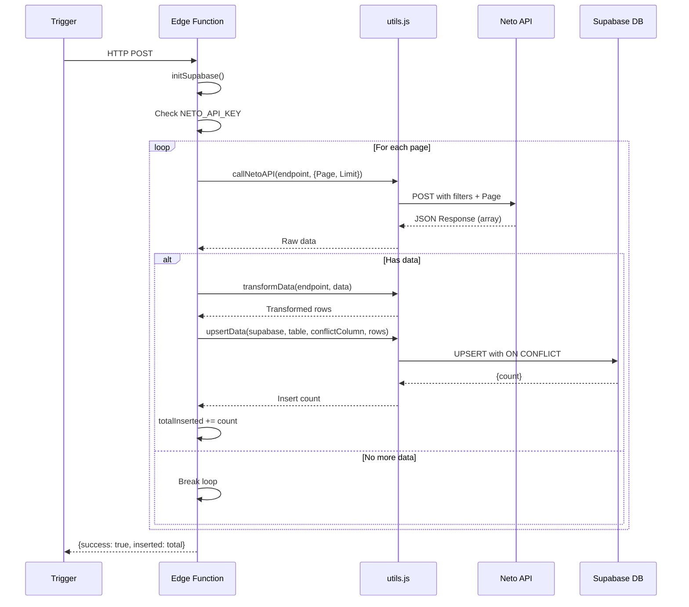

### Non-Paginated Data Sync (GetSupplier, GetCategory)

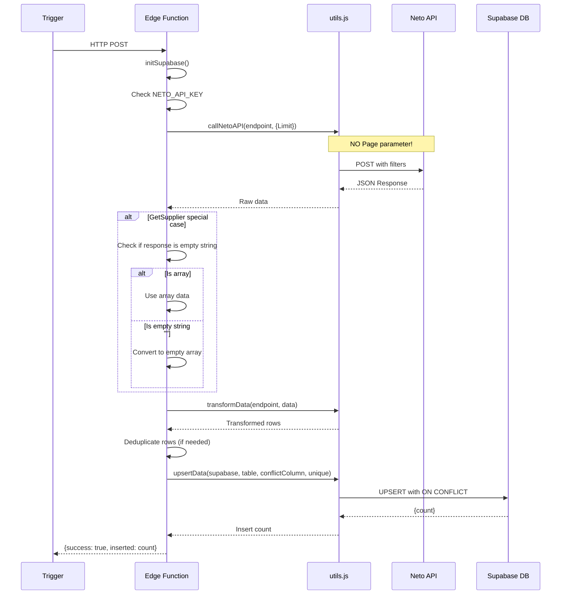

---

## utils.js Component Architecture

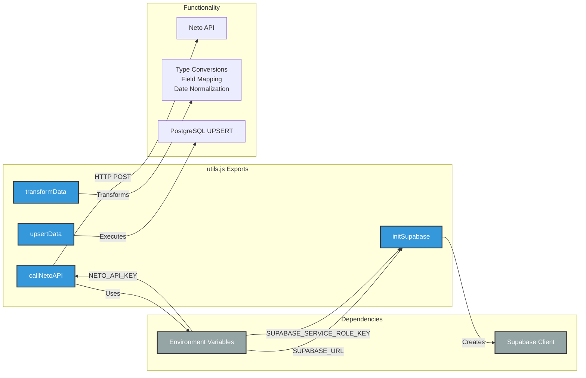

---

## Database Schema Relationships

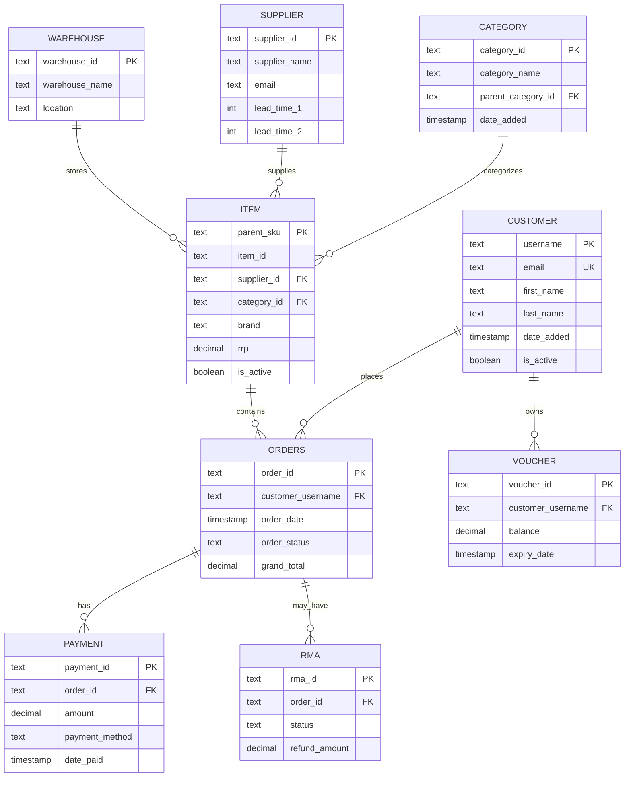

---

## Deployment Pipeline

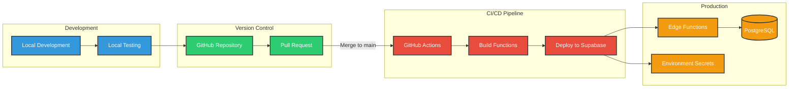

---

## Error Handling Flow

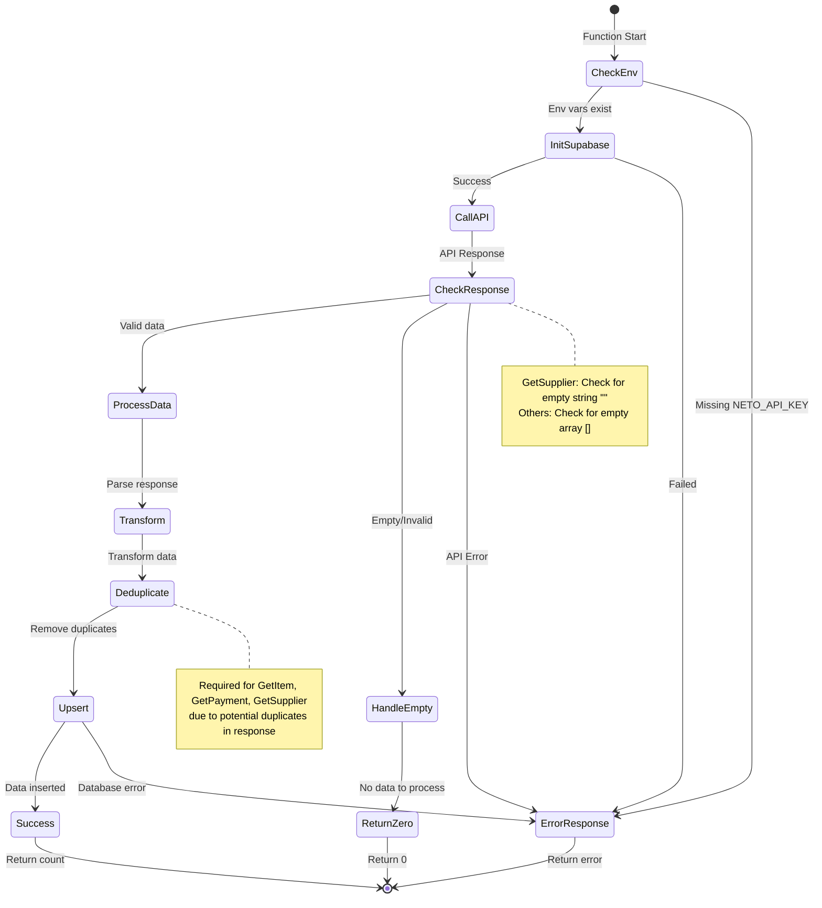

---

## Global Sync Orchestration

```mermaid
graph TB
    subgraph "global_sync.js Execution"
        START[Start global_sync]
        INIT[Initialize Supabase]
        
        subgraph "Sequential Execution"
            E1[Execute GetItem]
            E2[Execute GetCustomer]
            E3[Execute GetOrder]
            E4[Execute GetPayment]
            E5[Execute GetCategory]
            E6[Execute GetContent]
            E7[Execute GetWarehouse]
            E8[Execute GetRma]
            E9[Execute GetVoucher]
            E10[Execute GetSupplier]
        end
        
        COLLECT[Collect Results]
        RESPONSE[Return Summary]
    end

    START --> INIT
    INIT --> E1
    E1 --> |Continue on error| E2
    E2 --> |Continue on error| E3
    E3 --> |Continue on error| E4
    E4 --> |Continue on error| E5
    E5 --> |Continue on error| E6
    E6 --> |Continue on error| E7
    E7 --> |Continue on error| E8
    E8 --> |Continue on error| E9
    E9 --> |Continue on error| E10
    E10 --> COLLECT
    COLLECT --> RESPONSE

    classDef startEnd fill:#27ae60,stroke:#333,stroke-width:2px,color:#fff
    classDef process fill:#3498db,stroke:#333,stroke-width:2px,color:#fff
    classDef error fill:#e74c3c,stroke:#333,stroke-width:2px,color:#fff
    
    class START,RESPONSE startEnd
    class E1,E2,E3,E4,E5,E6,E7,E8,E9,E10,INIT,COLLECT process
```

---

## Security Architecture

```mermaid
graph TB
    subgraph "External Access"
        USER[User/Application]
        CRON[Cron Scheduler]
    end

    subgraph "Authentication Layer"
        AUTH[Supabase Auth]
        ANON[Anon Key]
        SERVICE[Service Role Key]
    end

    subgraph "Edge Functions"
        FUNC[Edge Function]
        SECRETS[Environment Secrets]
    end

    subgraph "External APIs"
        NETO[Neto API]
    end

    subgraph "Database"
        DB[(PostgreSQL)]
        RLS[Row Level Security]
    end

    USER --> |Bearer Token| AUTH
    CRON --> |Bearer Token| AUTH
    AUTH --> |Validates| ANON
    AUTH --> |Authorizes| FUNC
    
    FUNC --> |Reads| SECRETS
    SECRETS --> |Contains| SERVICE
    SECRETS --> |Contains| NETO_KEY[NETO_API_KEY]
    
    FUNC --> |Uses| SERVICE
    FUNC --> |Uses| NETO_KEY
    
    SERVICE --> |Full Access| DB
    NETO_KEY --> |Authenticates| NETO
    
    DB --> |Bypassed for Service Role| RLS

    classDef authClass fill:#e74c3c,stroke:#333,stroke-width:2px,color:#fff
    classDef secretClass fill:#f39c12,stroke:#333,stroke-width:2px,color:#fff
    classDef dbClass fill:#27ae60,stroke:#333,stroke-width:2px,color:#fff
    
    class AUTH,ANON,SERVICE authClass
    class SECRETS,NETO_KEY secretClass
    class DB,RLS dbClass

    note right of SERVICE
        Service Role Key bypasses RLS
        Never expose to client
    end note
```

---

## Performance Optimization Strategies

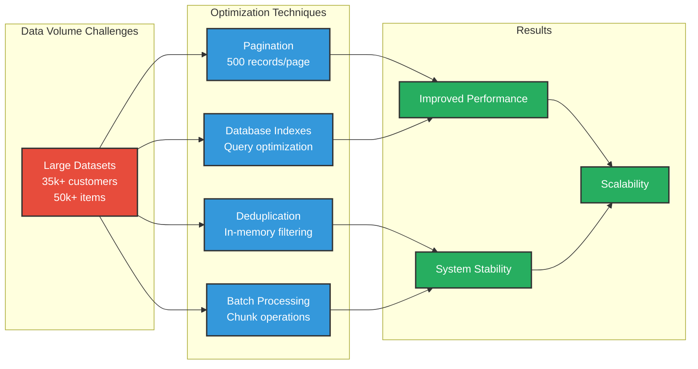

---

## Function Status Dashboard

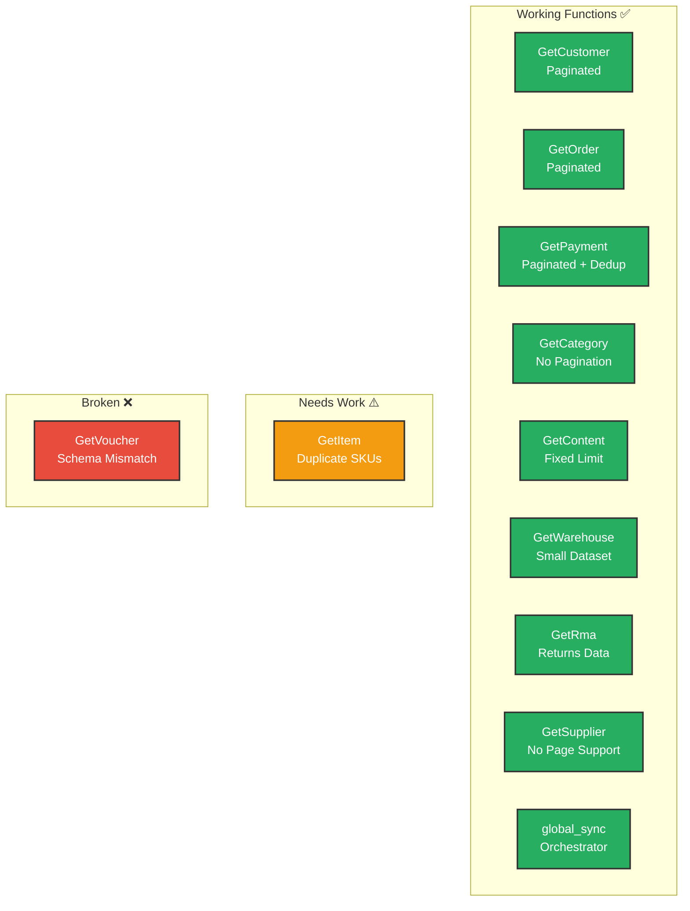

---

## Pagination Strategy Matrix

| Function | Pagination | Empty Response | Strategy | Notes |
|----------|------------|----------------|----------|-------|
| GetItem | ✅ Yes | `[]` | Page + Limit | Standard pagination |
| GetCustomer | ✅ Yes | `[]` | Page + Limit | 500/page recommended |
| GetOrder | ✅ Yes | `[]` | Page + Limit | Use date filters |
| GetPayment | ✅ Yes | `[]` | Page + Limit + Dedup | Duplicates possible |
| GetCategory | ❌ No | `[]` | Limit only | Small dataset |
| GetContent | ✅ Yes | `[]` | Page + Limit | ~200 pages max |
| GetWarehouse | ❌ No | `[]` | Limit only | ~10 records |
| GetRma | ❌ No | `[]` | Limit only | Variable size |
| GetVoucher | ❌ No | `[]` | Limit only | Schema issues |
| **GetSupplier** | ❌ **No** | `""` | **No Page!** | **Returns empty string** |

---

## Common Integration Patterns

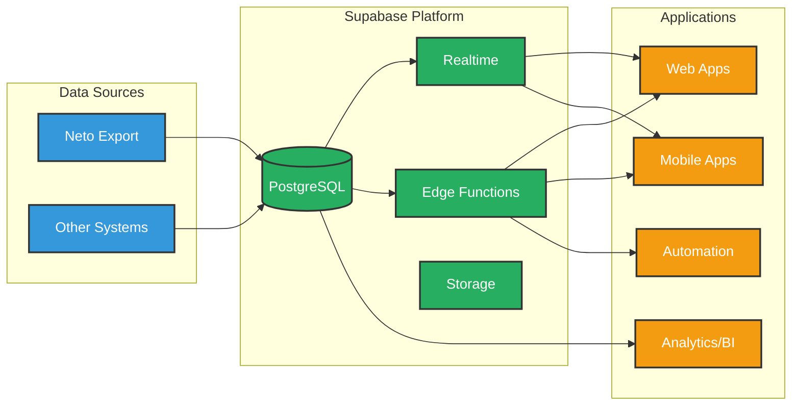

---

## Future Architecture Considerations

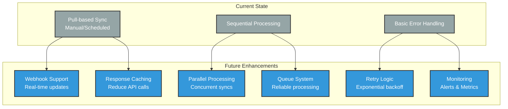