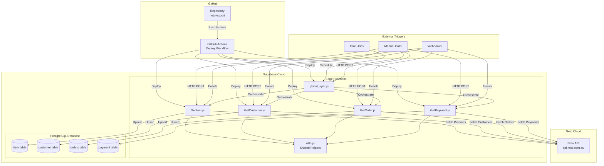
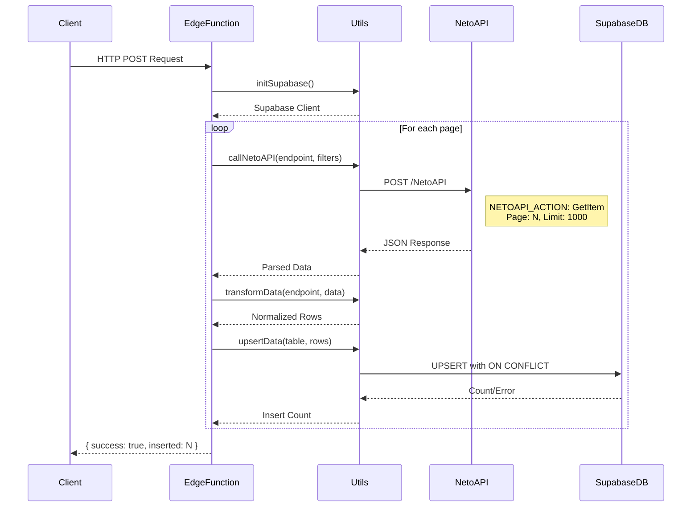
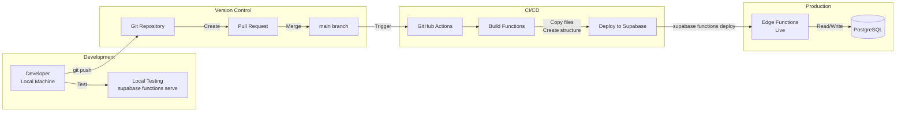
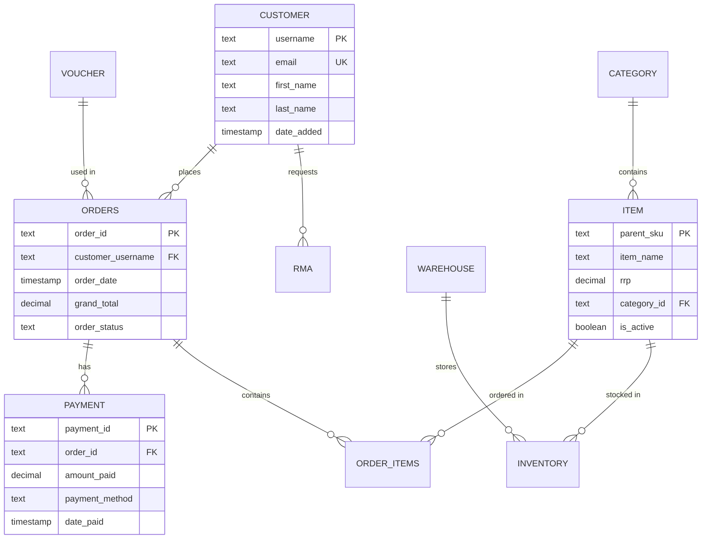
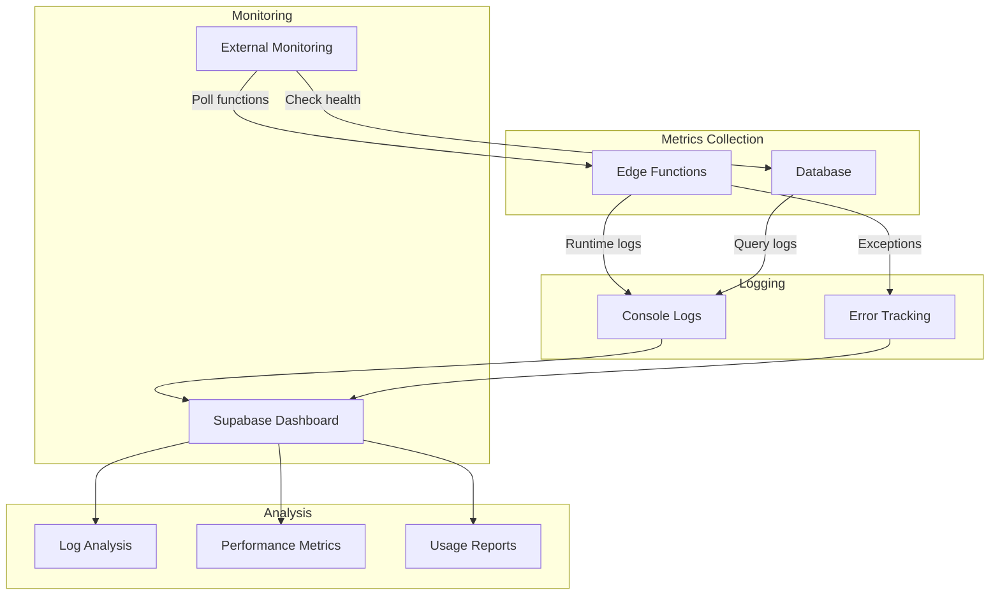

# Neto Export - Architecture Diagrams

## System Overview



## Data Flow Sequence



## Deployment Pipeline



## Function Architecture

```
┌─────────────────────────────────────────────────────────────┐
│                        Edge Function                         │
│                      (e.g., GetItem.js)                     │
├─────────────────────────────────────────────────────────────┤
│                                                             │
│  ┌─────────────────┐    ┌─────────────────┐               │
│  │   Constants     │    │  Filter Config  │               │
│  ├─────────────────┤    ├─────────────────┤               │
│  │ endpoint        │    │ DateFrom        │               │
│  │ table          │    │ DateTo          │               │
│  │ conflictColumn │    │ OutputSelector  │               │
│  └─────────────────┘    │ Limit           │               │
│                         └─────────────────┘               │
│                                                             │
│  ┌─────────────────────────────────────────────┐          │
│  │              Main Handler                     │          │
│  ├─────────────────────────────────────────────┤          │
│  │                                              │          │
│  │  1. Initialize Supabase Client               │          │
│  │     └─> utils.initSupabase()                │          │
│  │                                              │          │
│  │  2. Paginated Data Fetching                 │          │
│  │     ┌─────────────────────┐                │          │
│  │     │ while (hasMoreData) │                │          │
│  │     │   - Call Neto API   │                │          │
│  │     │   - Transform data  │                │          │
│  │     │   - Upsert to DB    │                │          │
│  │     │   - Track count     │                │          │
│  │     └─────────────────────┘                │          │
│  │                                              │          │
│  │  3. Return Response                          │          │
│  │     └─> { success, inserted, error }        │          │
│  └─────────────────────────────────────────────┘          │
│                                                             │
└─────────────────────────────────────────────────────────────┘
```

## Database Schema Relationships



## Error Handling Flow

```
┌─────────────┐     ┌──────────────┐     ┌─────────────┐
│   Trigger   │────>│ Edge Function│────>│  Neto API   │
└─────────────┘     └──────┬───────┘     └──────┬──────┘
                           │                      │
                           │                      ▼
                           │              ┌──────────────┐
                           │              │ API Error?   │
                           │              └──────┬───────┘
                           │                     │ Yes
                           │                     ▼
                           │              ┌──────────────┐
                           │              │  Log Error   │
                           │              │ Return 500   │
                           │              └──────────────┘
                           │
                           ▼
                    ┌──────────────┐
                    │ Transform OK? │
                    └──────┬────────┘
                           │ No
                           ▼
                    ┌──────────────┐
                    │ Log Warning   │
                    │ Skip Record   │
                    └──────┬────────┘
                           │
                           ▼
                    ┌──────────────┐
                    │  Upsert DB   │
                    └──────┬────────┘
                           │
                           ▼
                    ┌──────────────┐      ┌──────────────┐
                    │ DB Error?     │─Yes─>│ Log Error    │
                    └──────┬────────┘      │ Return Error │
                           │ No            └──────────────┘
                           ▼
                    ┌──────────────┐
                    │Return Success│
                    └──────────────┘
```

## Performance Optimization Strategy

```
Standard Flow (Sequential):
━━━━━━━━━━━━━━━━━━━━━━━━━━
Page 1 ──> Transform ──> Upsert ──> Page 2 ──> Transform ──> Upsert
   5s         1s          2s         5s         1s          2s     = 16s

Optimized Flow (Chunked Processing):
━━━━━━━━━━━━━━━━━━━━━━━━━━━━━━━━━━━
Page 1 ──┐
         ├──> Transform All ──> Upsert Chunks (100 rows each)
Page 2 ──┘
  10s            2s                    4s                     = 16s
  (parallel)                    (but lower memory usage)

Future Enhancement (Streaming):
━━━━━━━━━━━━━━━━━━━━━━━━━━━━━━━
Page 1 ──> Stream Transform ──> Stream Upsert ──┐
                                                 ├──> Done
Page 2 ──> Stream Transform ──> Stream Upsert ──┘
         (overlapping operations)                     = ~10s
```

## Monitoring & Observability



## Security Model

```
┌─────────────────────────────────────────────────────────┐
│                    Public Internet                       │
├─────────────────────────────────────────────────────────┤
│                                                         │
│  Clients          Must Have            Edge Functions  │
│  ┌─────┐         ┌─────────┐         ┌──────────────┐ │
│  │ App │────────>│ Anon Key│────────>│   Invoke     │ │
│  └─────┘         └─────────┘         └──────┬───────┘ │
│                                              │         │
├──────────────────────────────────────────────┼─────────┤
│                  Private/Secure               │         │
│                                              ▼         │
│  ┌────────────────┐         ┌─────────────────────┐   │
│  │ Service Role   │────────>│ Database Operations │   │
│  │ Key (Secret)   │         │ (Full Access)       │   │
│  └────────────────┘         └─────────────────────┘   │
│                                                         │
│  ┌────────────────┐         ┌─────────────────────┐   │
│  │ Neto API       │<────────│ API Calls           │   │
│  │ Credentials    │         │ (Authenticated)     │   │
│  └────────────────┘         └─────────────────────┘   │
└─────────────────────────────────────────────────────────┘
``` 